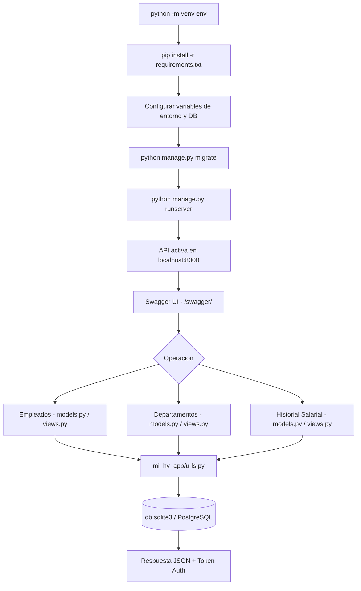

<div align="center">

# 📌 DESARROLLO PROYECTO API RECURSOS HUMANOS DJANGO  

## 📖 Descripción

</div>

---

Este sistema proporciona una API RESTful basada en Django para la gestión de empleados, departamentos y salarios dentro de una empresa.

## 🛠️ Funcionalidades  
- Creación, edición y eliminación de empleados.  
- Asignación de empleados a departamentos específicos.  
- Control de historial salarial con fechas de actualización.  
- Seguridad con autenticación basada en tokens.  

## Arquitectura



## 🚀 Tecnologías utilizadas  
- Django  
- Django REST Framework  
- PostgreSQL  
- Swagger para documentación de API  

## ▶️ Cómo ejecutar el proyecto  
1. Crear un entorno virtual:  
   ```bash
   python -m venv env
   source env/bin/activate  # Linux / Mac
   env\Scripts\activate  # Windows
   ```
2. Instalar dependencias:  
   ```bash
   pip install -r requirements.txt
   ```
3. Configurar las variables de entorno y base de datos.  
4. Ejecutar migraciones:  
   ```bash
   python manage.py migrate
   ```
5. Iniciar el servidor:  
   ```bash
   python manage.py runserver
   ```
6. Acceder a la documentación en `http://127.0.0.1:8000/swagger/`  

## 📌 Autor  
👨‍💻 **Alejandro De Mendoza**

---

## Autor

**Alejandro De Mendoza**  
Ingeniero Informático · Especialista en IA · Especialista en Ingeniería de Software · Máster en Arquitectura de Software

[](https://github.com/AlejoTechEngineer)
